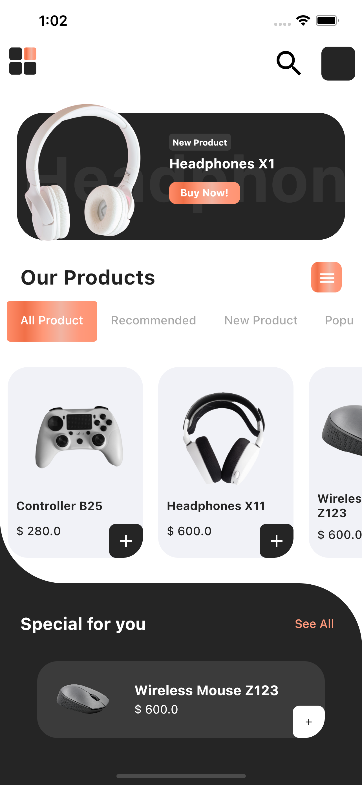
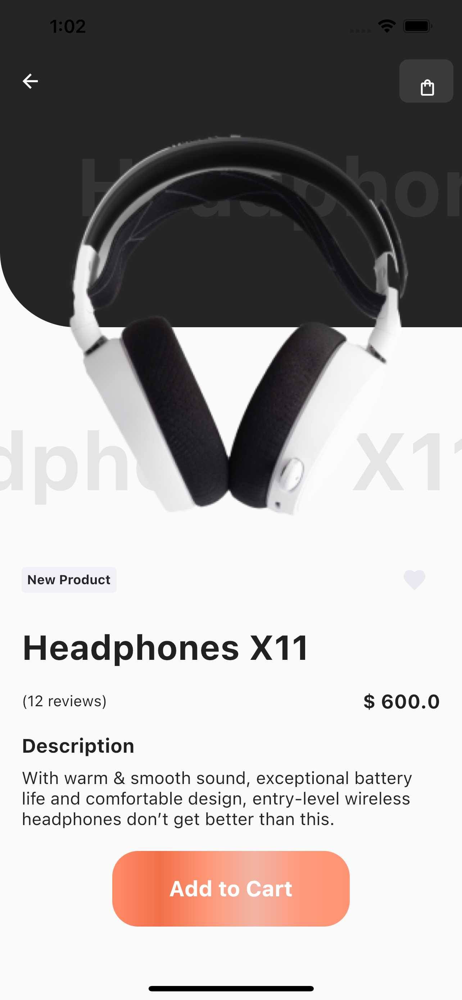

[![Contributors][contributors-shield]][contributors-url]

[![Forks][forks-shield]][forks-url]

[![Stargazers][stars-shield]][stars-url]

[![Issues][issues-shield]][issues-url]

[![MIT License][license-shield]][license-url]

[![LinkedIn][linkedin-shield]][linkedin-url]

<!-- PROJECT LOGO -->

<br  />

<p  align="center">

<a  href="https://github.com/WarMac4964/ShopUI-Concept">

</a>

<h3  align="center">Shop UI Concept</h3>

<p float="left">



  </p>

<p  align="center">

Cross-platform UI concept for shopping app written in Flutter/Dart.

<br  />

<br  />

·

<a  href="https://github.com/WarMac4964/ShopUI-Concept/issues">Report Bug</a>

·

<a  href="https://github.com/WarMac4964/ShopUI-Concept/issues">Request Feature</a>

</p>

</p>

<!-- TABLE OF CONTENTS -->

<details  open="open">

<summary>Table of Contents</summary>

<ol>

<li>

<a  href="#about-the-project">About The Project</a>

<ul>

<li><a  href="#built-with">Built With</a></li>

<li><a  href="#Feature">Features</a></li>

</ul>

</li>

<li>

<a  href="#getting-started">Getting Started</a>

</li>

<li><a  href="#contact">Contact</a></li>

</ol>

</details>

<!-- ABOUT THE PROJECT -->

## About The Project


UI Concept for shopping app written in Flutter/Dart for Android & iOS.

### Built With

- [Flutter](https://flutter.dev/)

- [Dart](https://dart.dev/)

## Getting Started

To start with the project, you can simply download the [apk]() here or you can follow along the instructions to

download and run the whole project in emulator.

1. Clone the repo

```sh

git clone https://github.com/WarMac4964/ShopUI-Concept.git

```

2. Inside the project folder run

```sh

flutter pub get

```

3. Open iOS/Android Emulator, For iOS the command is:

```sh

open -a simulator

```

4. Then run the project using

```sh

flutter run

```

See the [open issues](https://github.com/WarMac4964/ShopUI-Concept/issues) for a list of proposed features (and known issues).

<!-- CONTACT -->

## Contact

Anurag Tyagi - [@capttyg](https://www.instagram.com/capttyg/) - anurag.tyagi4964@gmail.com

Project Link: [https://github.com/WarMac4964/ShopUI-Concept](https://github.com/WarMac4964/ShopUI-Concept)

[contributors-shield]: https://img.shields.io/github/contributors/WarMac4964/ShopUI-Concept.svg?style=for-the-badge
[contributors-url]: https://github.com/WarMac4964/ShopUI-Concept/graphs/contributors
[forks-shield]: https://img.shields.io/github/forks/WarMac4964/ShopUI-Concept.svg?style=for-the-badge
[forks-url]: https://github.com/WarMac4964/ShopUI-Concept/network/members
[stars-shield]: https://img.shields.io/github/stars/WarMac4964/ShopUI-Concept.svg?style=for-the-badge
[stars-url]: https://github.com/WarMac4964/ShopUI-Concept/stargazers
[issues-shield]: https://img.shields.io/github/issues/WarMac4964/ShopUI-Concept.svg?style=for-the-badge
[issues-url]: https://github.com/WarMac4964/ShopUI-Concept/issues
[license-shield]: https://img.shields.io/github/license/WarMac4964/ShopUI-Concept.svg?style=for-the-badge
[license-url]: https://github.com/WarMac4964/ShopUI-Concept/blob/master/LICENSE.txt
[linkedin-shield]: https://img.shields.io/badge/-LinkedIn-black.svg?style=for-the-badge&logo=linkedin&colorB=555
[linkedin-url]: https://www.linkedin.com/in/anurag-tyagi-395425178/
